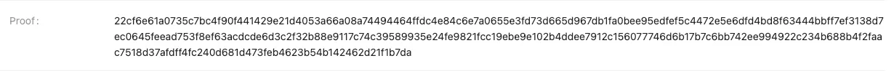

# How to access the devnet
## How to Apply for a Trial
Applying for early access to Jovay is quick and straightforward:
1. **Complete the [Application Form](https://docs.google.com/forms/d/e/1FAIpQLSevnOhIX14bomdvnXzUGsNgbYHR9wk1BqkQ4l-5eS4Jdiqw6Q/viewform):** Provide basic details including:
    - Full Name
    - Professional Email Address
    - Company Name & Your Position
    - Intended Use Cases (e.g., DeFi protocols, NFT infrastructure)
    - Source IP Address
2. **Submit & Await Activation:**

    Our team will promptly review your submission. Upon approval, you'll receive:
    - Dedicated Jovay Chain Endpoint URL
    - Integration Instructions

    
3. Verify that `yourJovay Chain Endpoint URL` is available. Replace the `YourJovayChainEndpointURL` with `your Jovay Chain Endpoint URL` obtained above. For curl installation, please refer to [Contract Deployment Tutorial](#contract-deployment-tutorial).
    ```
    curl --request POST --url YourJovayChainEndpointURL --header 'accept: application/json' --header 'content-type: application/json' --data '{"id": 1, "jsonrpc": "2.0", "method": "eth_chainId"}'
    ```
    The expected output is shown in the figure below: 
    

## Contract Deployment Tutorial
We encourage developers to deploy and test smart contracts on Jovay. This section will introduce how to deploy and invoke smart contracts compiled by DTVM-SDKs ([DTVM_SolSDK](https://github.com/DTVMStack/DTVM_SolSDK), [DTVM_CppSDK](https://github.com/DTVMStack/DTVM_CppSDK), etc.) on Jovay. All operators below are demonstrated on  **Ubuntu 22.04**.
> Note:
> - Jovay supports Solidity(version 0.8+) smart contract by DTVM_SolSDK. You can write contracts using familiar Solidity syntax, leveraging its rich features such as contract inheritance, library references, event and storage. Detailed Solidity syntax guides and examples can be found in the [Solidity official documentation](https://docs.soliditylang.org/en/v0.8.29/solidity-by-example.html).
> - In addition to Solidity, Jovay supports C++ for smart contract development by DTVM_CppSDK, providing convenience for developers who prefer system-level programming languages. DTVM_CppSDK offers a complete C++ contract development toolchain, including compilers and runtime libraries. For detailed information on C++ contract development, please refer to the [DTVM_CppSDK documentation](https://github.com/DTVMStack/DTVM_CppSDK/blob/main/docs/readme.md).
> - Additional DTVM contract languages will be gradually released. Stay tuned for more options in the future.

Before that, you need : 

1. prepare environment dependencies

    a. Update the system environment.

    ```
    apt update
    apt install wget curl vim -y     
    ```

    b. Install nodejs and npm in the recommanded way by [nodejs.org](https://nodejs.org/en/download/).

    ```
    # Download and install nvm:
    curl -o- https://raw.githubusercontent.com/nvm-sh/nvm/v0.40.3/install.sh | bash
    ```
    c. Install official Solidity compiler solc in the recommanded way [here](https://docs.soliditylang.org/en/latest/installing-solidity.html#linux-packages).

    ```
    apt install software-properties-common
    add-apt-repository ppa:ethereum/ethereum
    apt-get update
    # solc version must bigger than 0.8.25
    apt-get install solc -y
    ```

2. Prepare DTVM_SolSDK to complie Solidity into Wasm bytecode. You could download DTVM_SolSDK from [here](https://github.com/DTVMStack/DTVM_SolSDK/releases/tag/v0.1.0), we use [DTVM_SolSDK-0.1.0-Linux-ubuntu22.04.tar.gz](https://github.com/DTVMStack/DTVM_SolSDK/releases/download/v0.1.0/DTVM_SolSDK-0.1.0-Linux-ubuntu22.04.tar.gz)  for demo purpose.

    > sha256sum DTVM_SolSDK-0.1.0-Linux-ubuntu22.04.tar.gz
    > a291264971b0a1708795bf45b731fe6958c864bcbcd6cdb2f9aed1db45c11424  DTVM_SolSDK-0.1.0-Linux-ubuntu22.04.tar.gz

    ```
    cd ~
    wget https://github.com/DTVMStack/DTVM_SolSDK/releases/download/v0.1.0/DTVM_SolSDK-0.1.0-Linux-ubuntu22.04.tar.gz
    mkdir dtvm
    tar -zxvf DTVM_SolSDK-0.1.0-Linux-ubuntu22.04.tar.gz -C dtvm
    export PATH=$PATH:$(pwd)/dtvm/DTVM_SolSDK-7861fb3-Linux
    ```
3. Since **Jovay uses ETH from Sepolia for gas fees**, you need to deposit ETH into your Jovay account by calling Deposit in the [Bridge ETH between Sepolia and Jovay](#bridge-eth-between-sepolia-and-jovay). This operation transfers ETH from Sepolia to Jovay and is necessary to facilitate subsequent transactions. **Notice: this step will transfer your ETH from Sepolia to Jovay**.

4. For simplicity, we provide example scripts: [jovay-guide.tar.gz](https://static.zan.top/static/Jovay/jovay-guide.tar.gz) for deploying and calling contract by web3js. And you can also use web3js to interact with the Jovay yourself without this example.

    > sha256sum jovay-guide.tar.gz
    > 7d9330811914429aa7c6df7765b30b8071822924b8969e8927804ab6c4be1181  jovay-guide.tar.gz
    ```
    cd ~
    wget https://static.zan.top/static/Jovay/jovay-guide.tar.gz
    mkdir jovay-guide
    tar -zxvf jovay-guide.tar.gz -C jovay-guide/
    cd jovay-guide/
    npm install
    ```
    ```shell
    jovay-guide
    ├── .env.example
    ├── conf
    │   └── abi
    │       ├── JovayExample.abi        // the abi of example contract
    │       ├── L1ETHBridge.abi         // the abi of bridge contract on Sepolia used by bridging
    │       └── L2ETHBridge.abi         // the abi of bridge contract on Jovay used by bridging
    ├── package-lock.json
    ├── package.json
    ├── scripts
    │   ├── eth_bridge.js               // the script for bridging ETH; include deposit, withdraw, finalizeWithdraw
    │   └── interact_with_contract.js   // the scripy for deploy and invoke contract on Jovay
    └── src
        └── contracts
            └── jovay_example.sol

    6 directories, 9 files

    ```
    Before using scripts, you need to prepare the `.env` using `.env.example`, and modify `PRIVATE_KEY` and `OWNER_ADDR` in it, and replace `RPC_URL` with your Sepolia JSON-RPC endpoint and replace `L2_RPC_URL` with the `Jovay Chain Endpoint URL` obtained from section [How to Apply for a Trial](#how-to-apply-for-a-trial). 

    > Note: If you don't have a Sepolia RPC endpoint, try to get one from [zan.top](https://zan.top/home/node-service).
    ```
    mv .env.example .env
    ```
    ```
    RPC_URL="url of Sepolia"
    L2_RPC_URL="url of Jovay"

    # the address of your acoount on Sepolia
    L1_OWNER_ADDR=bar
    # the address of your acoount on Jovay
    L2_OWNER_ADDR=foo

    # the private key of your account on Sepolia
    L1_PRIVATE_KEY=bar
    # the private key of your account on Jovay
    L2_PRIVATE_KEY=foo

    # ETH Bridge Contract on Sepolia
    L1_ETH_BRIDGE_ADDR=0x10Ec05757Af363080443110BFd2e86C4406E4732
    # ETH Bridge Contract on Jovay
    L2_ETH_BRIDGE_ADDR=0x38675d92813338953b0f67e9cc36be59282b77e3

    L1_ETH_BRIDGE_ABI=conf/abi/L1ETHBridge.abi
    L2_ETH_BRIDGE_ABI=conf/abi/L2ETHBridge.abi    
    ```

Now, let's work with the simple example contract:

```
// SPDX-License-Identifier: UNLICENSED
pragma solidity ^0.8.0;

contract JovayExample {
    string private content = "welcome to Jovay";

    function SetContent(string memory _new_content) public {
        content = _new_content;
    }

    function GetContent() public view returns (string memory){
        return content;
    }
}
```

The example contract above can be found `injovay-guide.tar.gz`. And our following operations are based on this script package.

First, compile the Solidity smart contract into Wasm bytecode:
```
cd ~/jovay-guide/
// Step 1: Compile Solidity to Yul IR
solc --ir --optimize-yul -o . --abi --overwrite src/contracts/jovay_example.sol

// Step 2: Compile Yul IR to WebAssembly
yul2wasm --input JovayExample.yul --output jovay_example.wasm
```
Executing the above command will generate the file `jovay_example.cbin.hex` in the current directory. 

Second, deploy Wasm bytecode by `scripts/interact_with_contract.js`. Specify Wasm bytecode file and gas_price in command.
|Parameter|Description|Example|
|--|--|--|
|`wasm_bytecode`|The Wasm bytecode will be deployed to the Jovay chain.|jovay_example.cbin.hex|
|`gas_price`|The max fee per gas on Jovay. A value greater than 1 is recommended.|4|
```
node scripts/interact_with_contract.js deploy jovay_example.cbin.hex $gas_price
```
You can find your deployed contract address under the `contractAddress` field of the json format transaction receipt, e.g. shown below:
```
  contractAddress: '0x3b87b43889bbe72b9d6175c7c7f91c54814c6134',
```

And then, you can invoke your contract on Jovay.

Replace the parameter `contract_address` from the below-here command with your deployed contract address. And run the below script to invoke `SetContent` method.

|Parameter|Description|Example|
|--|--|--|
|`contract_address`|The address of the contract on Jovay that you want to invoke.|`0x3b87b43889bbe72b9d6175c7c7f91c54814c6134`|
|`abi`|The abi file of contract; You can get this file by adding the `--abi` parameter to the solc command.|4conf/abi/JovayExample.abi|
|`method_parameter`|The method parameter of `SetContent`.|"hello jovay"|
|`gas_price`|Max fee of per gas on Jovay; It is recommended to set it to a value greater than 1.|4|

```
node scripts/interact_with_contract.js call_SetContent $contract_address conf/abi/JovayExample.abi $method_parameter $gas_price 
```
Replace the parameter of the below command, then execute the command below to invoke `GetContent` of contract.

|Parameter|Description|Example|
|--|--|--|
|`contract_address`|The address of the contract on Jovay that you want to invoke.|`0x3b87b43889bbe72b9d6175c7c7f91c54814c6134`|
|`abi`|The abi file of contract. You can get this file by adding the `--abi` parameter to the solc command.|conf/abi/JovayExample.abi|

```
node scripts/interact_with_contract.js call_GetContent $contract_address conf/abi/JovayExample.abi 
```
If the call succeeds, you will see:
```
🎉🎉 content:  hello jovay
```
> Note:
> ⌛ The result may take about 10 seconds to appear, please be patient.
Any subsequent contract invocations on either Sepolia or Jovay may also take roughly 10 seconds to complete.


## Bridge ETH between Sepolia and Jovay
This section describes how to bridge ETH between Sepolia and Jovay.

Jovay provides ETH bridge contracts for bridging eth between Sepolia and Jovay:

- ETH Bridge Contract on Sepolia: `0x10Ec05757Af363080443110BFd2e86C4406E4732`
- ETH Bridge Contract on Jovay: `0x38675d92813338953b0f67e9cc36be59282b77e3`

You can deposit ETH from Sepolia to Jovay by calling `deposit` on Sepolia. To withdraw, call `withdraw` on Jovay and then `relayMsgWithProof` on Sepolia to finalize the withdrawal and transfer the ETH back to your Sepolia account.

### Deposit from Sepolia to Jovay
```
/**
 * user deposit eth from Sepolia to Jovay;
 * @param to_; deposit target address on Jovay;
 * @param amount_; deposit amount;
 * @param gasLimit_; gas limit of finalize deposit on Jovay（should bigger 1200000）
 * @param msg_; Not used yet, extended field; please set "0x"
 */
function deposit(address to_, uint256 amount_, uint256 gasLimit_, bytes memory msg_) external payable;
```
The bridge operation script is included in the `jovay-guide.tar.gz` package. Please ensure that the `.env` file is properly configured before bridging ETH, exactly as described in the [Contract Deployment Tutorial](#contract-deployment-tutorial).

To deposit ETH from Sepolia to your address on Jovay, please prepare the required parameters before running the following command:

| Parameter  | Description  |Example | 
|---|---|---|
| `to`  |  The target address on Jovay to receive the deposited ETH. This should be set to `L2_OWNER_ADDR`.  | $L2_OWNER_ADDR  |
|`amount`  | Amount to transfer to the deposit target. Ensure your Sepolia account has sufficient balance.  |10000000000 (wei)   | 
|`gaslimit`   | The gas limit to be used for the L2 transfer transaction associated with L1. Must be greater than 1,200,000 to ensure sufficient gas on Jovay.  | 7000000   |
| `value`  | The deposit value must exceed the sum of the gas limit and the transfer amount.  |11000000000 (wei) | 
|`gas_price` |  The max fee per gas on Sepolia. It is recommended to set this value based on the base fee of the current Sepolia block.  |40630943068  |

```
source .env
node scripts/eth_bridge.js depositEth $to $amount $gaslimit $value $gas_price 
```
If successful, you will see output similar to the following:
```
✅✅ Transaction hash : 0x3faf88dd361e180a2299451ab15c4bf3460f7a57cc06c3026c99248718327bf0
🎉🎉 Send transaction success.
```
By running the above command, you transferred 11,000,000,000 wei to the Sepolia ETH Bridge Contract. Of this amount, 10,007,000,000 wei was successfully transferred to Jovay, and the remainder was refunded to your wallet account. Within the transferred amount, 10,000,000,000 wei was deposited to your account on Jovay, while 7,000,000 wei was collected as the bridge fee.
You can check on [Jovay Explorer](http://explorer.jovay.io/l2/home?bizId=ethdevnetl2&unionId=100100) whether the L1 `deposit` transaction has been delivered to Jovay; this process may take up to 25 minutes. Once the `deposit` is confirmed on Jovay, an L2 transaction hash will be displayed instead of a pending claim.


### WithDraw from Jovay to Sepolia
To withdraw ETH from Jovay to Sepolia, you need to invoke `withdraw` on the ETH Bridge Contract on Jovay, and then invoke `relayMsgWithProof` on the ETH Bridge Contract on Sepolia.
```solidity
/**
 * user withdraw eth from Jovay to Sepolia;
 * @param to_; withdraw target address on Sepolia;
 * @param amount_; withdraw amount;
 * @param gasLimit_; gas limit of finalize withdraw on Sepolia （should bigger 150000）
 * @param msg_; Not used yet, extended field; please set "0x"
 */
function withdraw(address to_, uint256 amount_, uint256 gasLimit_, bytes memory msg_) external payable;

/**
 * finalize withdraw and transfer eth to target address on Sepolia;
 * @param amount_; withdraw amount;
 * @param nonce_; the L2 withdraw tx's nonce of L2 Msg queue; 
 * @param msg_; Not used yet, extended field; please set "0x"
 * @param proof_; the proof of L2 Msg; include batch_index and spv_proof;
 */
function relayMsgWithProof(
    uint256 amount_,
    uint256 nonce_,
    bytes memory msg_,
    IL1Mailbox.L2MsgProof memory proof_
) external payable;
```
#### withdraw
Invoking `withdraw` on Jovay moves ETH to the bridge contract but not to Sepolia. Prepare the following parameters before executing the command:

| Parameter  | Description  |Example | 
|---|---|---|
| `to`  |  The address to receive the withdrawn ETH on Sepolia. This should be set to `L1_OWNER_ADDR`. | $L1_OWNER_ADDR  |
|`amount`  | The amount of ETH to transfer to the withdrawal target address. Please ensure that sufficient balance remains to cover both the gas cost of this withdrawal transaction and the associated L1 transaction on Sepolia.  |105 (wei)</br>e.g. account balance `- gaslimit`* `base_fee` - 1,500,000 * `gas_price`</br><div class="alert alert-notes">**Note:** The approximate gas consumption for an L2 transaction is 1,500,000.</br>The current base fee is set to 1.</div> | 
|`gaslimit`   | The gas limit for the L1 transfer transaction associated with the L2 withdrawal.  | 1130000  |
| `value`  | The total value to send with the withdrawal transaction. It must be greater than the sum of the gas limit and the transfer amount.  |1200000 (wei) | 
|`gas_price` |  The maximum gas fee per unit on Jovay. It is recommended to set this value greater than 1. | 4  |
```
source .env
node scripts/eth_bridge.js withdrawEth $to $amount $gaslimit $value $gas_price
```
If successful, you will see output similar to the following:
```
✅✅ Transaction hash : 0x620629487a0497afd77c838637fa4a57e9c4cdf72cd9993ea35c9e3bff6a3e7a
🎉🎉 Send transaction success.
```
After sending thewithdrawtransaction on Jovay, wait for the next batch (~20 minutes) to roll up to Sepolia. Searchwithdrawtransaction hash on Jovay Explorer to view the details.


Once the batch is verified on L1, the Proof field will display a hex value. At that point, you can proceed to execute `finalizeWithdraw`.



#### finalizeWithdraw
Finalizing a withdrawal on Sepolia triggers the Bridge contract to transfer ETH to the target address, based on the L2 message produced by the Jovay `withdraw` transaction.

The following commands can only be executed after the Jovay `withdraw` transaction has been finalized on Sepolia. Enter thewithdrawtransaction hash on the [Jovay Explorer](http://explorer.jovay.io/l2/home?bizId=ethdevnetl2&unionId=100100) to navigate to the transaction details page, where the finalization status will be displayed. Then you can find the proof we descriped and assume that you already have the proof from the transaction detail page.

Please prepare the script parameters as listed in the table below before executing the following command.

| Parameter  |  Description  | Value  |
|---|---|---|
| `batch_index`  | the batch index of `withdraw` hash. you can find at [jovay explorer](http://explorer.jovay.io/l2/home?bizId=ethdevnetl2&unionId=100100).</br><ol><li>Search `withdraw` tx hash.</br></li><li>Click the Block Number.</br></li></ol>  | 122  | 
|`tx_hash`  |The `withdraw` transaction was sent on Jovay. The script automatically retrieves the `nonce` and `msg` from the L2 message.  | `0x620629487a0497afd77c838637fa4a57e9c4cdf72cd9993ea35c9e3bff6a3e7a` |
|`proof`   |  The spv proof of L2 withdrawmsg. you can find at [jovay explorer](http://explorer.jovay.io/l2/home?bizId=ethdevnetl2&unionId=100100) after batch is **finalized**.</br>Search withdraw tx hash and check the status is finalized</br>| 0000000000000000000000000000000000000000000000000000000000000000ad3228b676f7d3cd4284a5443f17f1962b36e491b30a40b2405849e597ba5fb5b4c11951957c6f8f642c4af61cd6b24640fec6dc7fc607ee8206a99e92410d3021ddb9a356815c3fac1026b6dec5df3124afbadb485c9ba5a3e3398a04b7ba8524540cfcbc067229a7d700b686a7f626a5362b21e569dcdb84d3e9c1dde6895c  |
|`gas_price` | Max fee per gas on Sepolia. It is recommended to set this value based on the base fee of the current Sepolia block.  | 40630943068  |
```
node scripts/eth_bridge.js finalizeWithdraw $batch_index $tx_hash $proof $gas_price
```

If successful, you will see output similar to the following:
```
withdraw tx hash is :  
withdraw msg is  0x3925166e0000000000000000000000002cc298bdee7cfeac9b49f9659e2f3d637e1496960000000000000000000000007cad994fc1c0d94ef232fbe3b45b685018ee59b6000000000000000000000000000000000000000000000000000000000000006900000000000000000000000000000000000000000000000000000000000000800000000000000000000000000000000000000000000000000000000000000000
withdraw msg nonce is  16n
withdraw amount is  105n
Sending tx ...
✅✅ Transaction hash : 0xe8f9336bf1cb8eef615175d5b0c02e38b48b7a4abb9d6ec041e58d715b372d4d
🎉🎉 Send transaction success.
```
By sending this transaction to Sepolia, the `relayMsgWithProof` method on the Sepolia ETH Bridge Contract is invoked to complete withdrawal proof validation, resulting in 105 wei being successfully withdrawn to your account.


## Jovay API
Jovay is fully compatible with the Ethereum ecosystem, offering native support for standard Ethereum JSON-RPC interfaces. Developers can seamlessly integrate using popular tools and libraries such as Web3j, Web3.js, or ethers.js, without the need for custom adaptations. This enables existing Ethereum applications to migrate or expand to the Jovay with minimal effort, reducing integration costs and accelerating development.

The table2 indicates how each **Ethereum JSON-RPC** method behaves on the Jovay. All request and response parameters follow the canonical [Ethereum JSON-RPC specification](https://ethereum.org/en/developers/docs/apis/json-rpc/). Only the runtime semantics differ for entries marked with ⚠️.

table1: Status Meanings in table2
| Status  | Meaning on Jovay  | Guidance for dApp developers  |
|---|---|---|
| ✅  | **Fully compatible** – request and response semantics are identical to Ethereum mainnet.  | Use the method exactly as defined in the Ethereum JSON-RPC specification.  |
| ⚠️ | **Semantically different** – the method is implemented, but its return value or behavior diverges (e.g., no PoW, no uncle blocks). See the Note column for details.  | Review the deviation and add fallback logic if required. |
| ❌ | **Not supported** – the method is not available (typically wallet or filter features).  | Replace, stub, or omit the call until future support is announced.  |

table2: Jovay JSON-RPC List
| Ethereum JSON-RPC API | Status  | Note  |
|---|---|---|
| eth_protocolVersion | ⚠️ | Always Returns `0x41`  |
| eth_syncing | ⚠️ | Returns `false` due to disabled sync and consensus |
| eth_coinbase | ⚠️  | Returns `0x0` due to unimplemented coinbase functionality |
|eth_chainId  | ✅ |  |
|eth_mining  | ⚠️ | Returns `false` due to the absence of PoW functionality in L2 |
| eth_hashrate |⚠️  | Returns `0x0` due to the absence of PoW functionality in L2 |
| eth_gasPrice | ✅ |  |
| eth_accounts | ⚠️ | Returns `empty array` due to wallet functionality  unimplemented |
| eth_blockNumber | ✅ |  |
| eth_getBalance | ✅ |  |
| eth_getStorageAt | ✅ |  |
| eth_getTransactionCount |✅  |  |
| eth_getBlockTransactionCountByHash | ✅ |  |
| eth_getBlockTransactionCountByNumber | ✅ |  |
| eth_getUncleCountByBlockHash | ⚠️ | Returns `0x0` due to the L2 chain having no uncle blocks |
| eth_getUncleCountByBlockNumber |⚠️  | Returns `0x0` due to the L2 chain having no uncle blocks |
|eth_getCode  | ✅ |  |
| eth_sign | ❌ |not provided due to wallet functionality  unimplemented  |
| eth_signTransaction | ❌ | not provided due to wallet functionality  unimplemented |
| eth_sendTransaction | ❌ | not provided due to wallet functionality  unimplemented |
| eth_sendRawTransaction | ✅ |  |
|eth_call  | ✅ |  |
| eth_estimateGas |✅  |  |
| eth_getBlockByHash | ✅ |  |
| eth_getBlockByNumber | ✅ |  |
| eth_getTransactionByHash |✅  |  |
| eth_getTransactionByBlockHashAndIndex |✅  |  |
| eth_getTransactionByBlockNumberAndIndex |✅  |  |
| eth_getTransactionReceipt |✅  |  |
| eth_getUncleByBlockHashAndIndex | ⚠️ | Returns `null` due to the L2 chain having no uncle blocks |
| eth_getUncleByBlockNumberAndIndex | ⚠️ | Returns `null` due to the L2 chain having no uncle blocks |
| eth_newFilter |❌  | not provided due to filter functionality unimplemented |
| eth_newBlockFilter | ❌ |not provided due to filter functionality unimplemented |
| eth_newPendingTransactionFilter | ❌ |not provided due to filter functionality unimplemented |
| eth_uninstallFilter | ❌ | not provided due to filter functionality unimplemented |
|eth_getFilterChanges|❌|not provided due to filter functionality unimplemented|
|eth_getFilterLogs|❌|not provided due to filter functionality unimplemented  |
|eth_getLogs|✅| |
|eth_maxPriorityFeePerGas|⚠️|Returns `0x0` due to the absence of priority-fee scheduling|
|eth_getAccount|✅| |